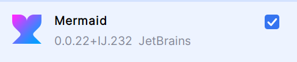

# XYZ Bank - Danny Vera

Sistema para gestionar transacciones bancarias entre cuentas de clientes. El sistema debe permitir la creación de
clientes, cuentas, y realizar transacciones entre ellas (retiros y depósitos). Este sistema estará dividido en
microservicios independientes que se comunicarán entre sí. El proyecto se documentará utilizando OpenAPI y se
presentarán diagramas de secuencia y diagramas de componentes para ilustrar la arquitectura

# Documentación y diagramas:

- [Diagrama de Uso](Documentacion%2FDiagramaDeUso.md)
- [Diagramas de Secuencia](Documentacion%2FDiagramaDeSecuencia.md)
- [Diagrama de Componente.md](Documentacion%2FDiagramaDeComponente.md)
- [Documentación OpenApi](Documentacion%2Fswagger.md)

Para ver diagramas de secuencia descargar el siguiente pluggin:

# Microservicios

- **Gateway** Proporcionar un punto de entrada a nuestro ecosistema de microservicios

  - Punto de entrada http://localhost:8080/

- **Registry service**: Registrar y localizar micro-servicios
    - Registry: http://localhost:8761/

- **CustomerMS:** Crear, leer, actualizar y eliminar (CRUD) información de clientes.
    - CustomerMS: http://localhost:8081/customer

- **AccountMS:** Crear, leer, actualizar, depositar dinero, retirar dinero y eliminar cuentas bancarias asociadas a
  clientes
    - AccountMS: http://localhost:8082/account

# Base de Datos

- **H2 Base de datos** relacional que funciona como una base de datos en memoria

# Reglas de negocio

1. Validaciones de Cliente:

- Cada cliente debe tener un DNI único.
- No se permite eliminar un cliente si tiene cuentas activas.

2. Validaciones de Cuentas Bancarias:

- El saldo inicial de una cuenta debe ser mayor a 0.
- No se puede realizar un retiro que deje el saldo en negativo para cuentas de ahorro.
- Las cuentas corrientes pueden tener un sobregiro de hasta -500.

# Instrucciones

1. Levantar los servicios Registry, Gateway, AccountMs y CustomerMs:

  - AccountMS ⮕ http://localhost:8080/account
  - CustomerMS ⮕ http://localhost:8080/customer
  - Eureka ⮕ http://localhost:8080/eureka/main

2. Importar las [colecciones](Documentacion%2FNTT%20DATA%20BANK.postman_collection.json) en Postman

3. Probar los endpoints

> Nota para ver la DB entrar a las siguientes rutas:
> http://localhost:8080/customer-h2-console
> http://localhost:8080/account-h2-console
> 
> jdbc:h2:mem:customerdb
> 
> jdbc:h2:mem:accountdb
> 
> usuario:SA
> 
> password: password
> 
